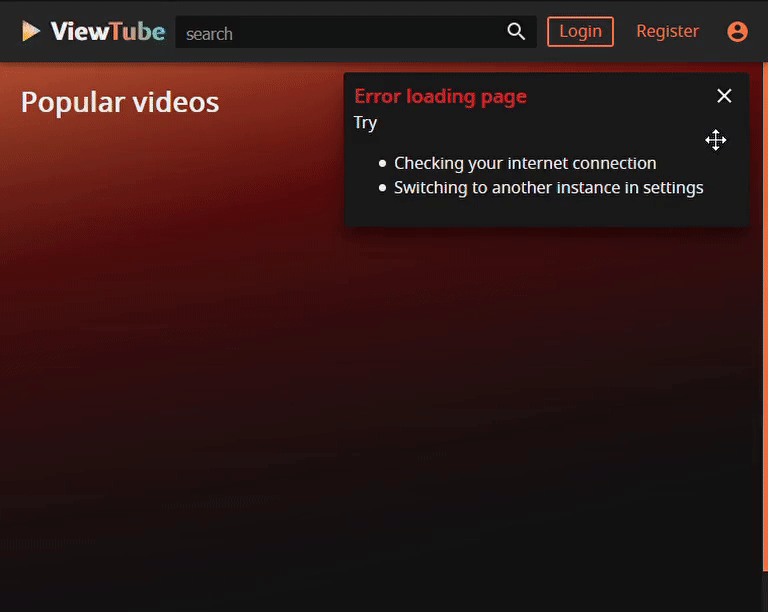
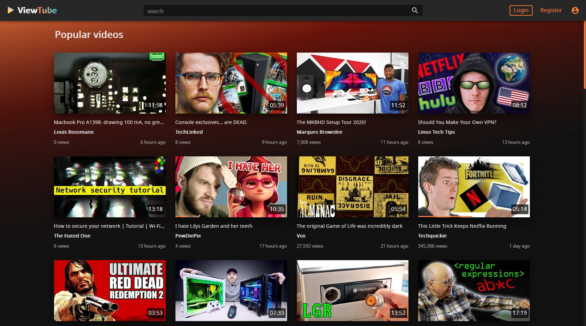
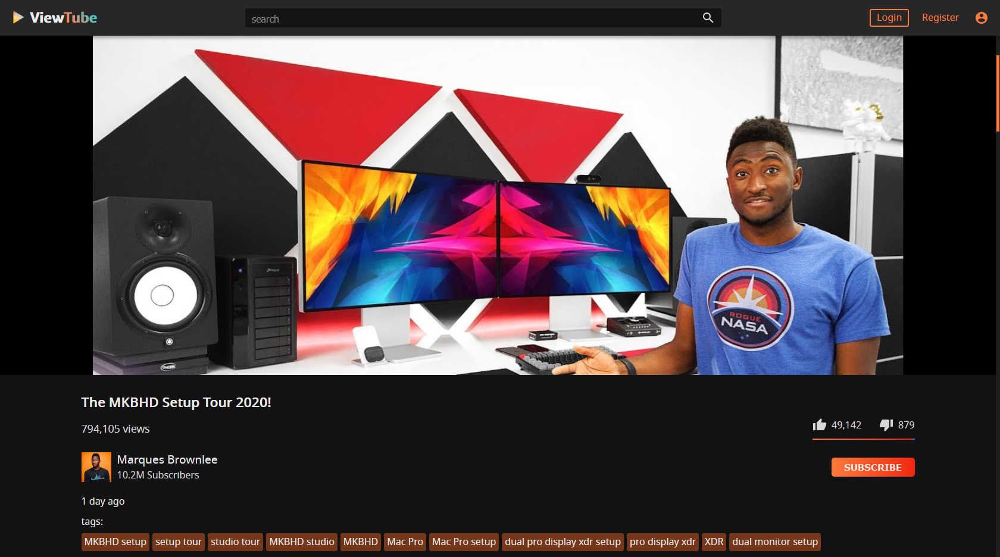

<h1 align="center">
<sub>

</sub>
ViewTube
</h1>

ViewTube is an alternative YouTube frontend using the [invidio.us](https://github.com/iv-org/invidious) API.

It can recommend, play and search for videos. It saves your watch progress and you can subscribe to channels for them to appear in your subscription feed.

[](https://deepscan.io/dashboard#view=project&tid=11097&pid=14017&bid=262917)
[](https://drone.oeger.li/ViewTube/viewtube-vue)
[](https://vuejs.org/)
[](https://github.com/ViewTube/viewtube-vue/blob/stable/LICENSE)


<h2 align="center">
<sub>

</sub>
Features
</h2>

- Watch videos without ads or tracking
- Read comments
- Search for videos
- Subscribe to channels and see their latest uploads
- Receive push notifications for subscribed channels
- Responsive: mobile and desktop friendly

<h2 align="center">
<sub>

</sub>
Why not just use invidio.us?
</h2>

Invidious instances can easily get rate-limited by Google. With ViewTube, you can <b>switch between instances</b>. Your subscriptions, settings, etc. are stored on your <b>ViewTube account</b>.

<table>
 <tr>
   <td valign="top">
     Your selected instance is slow or doesn't work?
     <br>
     Just go to settings > instance and choose a different one!
     <br>
     Instances are fetched from the <a href="https://github.com/iv-org/documentation/blob/master/Invidious-Instances.md">invidious wiki</a>.
   </td>
   <td></td>
 </tr>
</table>

<h2 align="center">
<sub>

</sub>
Screenshots
</h2>

<h3 align="center">
Homepage
</h3>



<h3 align="center">
Video
</h3>



<h3 align="center">
Channel
</h3>


<h2 align="center">
<sub>

</sub>
Host it yourself
</h2>

A more comprehensive installation guide is available in the [wiki](https://github.com/ViewTube/viewtube-vue/wiki/Installation)

<h3 align="center">
<sub>

</sub>
Docker
</h3>

Example docker command

```docker
$ docker create \
  --name=viewtube
  -p 8066:8066
  -v /path/to/data:/data \
  -e VIEWTUBE_API_URL=https://api.viewtube.io/
  --restart unless-stopped \
  mauriceo/viewtube:latest
```

Docker-compose

```yml
version: '3'

services:
  viewtube:
    container_name: viewtube
    restart: unless-stopped
    image: mauriceo/viewtube:latest
    volumes:
      - /etc/localtime:/etc/localtime:ro
      - ./data:/data
    environment:
      - VIEWTUBE_API_URL=https://api.viewtube.io/
    ports:
      - 8066:8066
```

<h2 align="center">
<sub>

</sub>
Development setup
</h2>

Prerequisites

- Nodejs v14.x
- Yarn 1.22
- MongoDB 4.4.x

Instructions

1.  Clone this repo

    `git clone https://github.com/ViewTube/viewtube-vue`

2.  Install dependencies

    `yarn install`

3.  Start the dev server

    `yarn serve`

4.  Visit [localhost:8066](http://localhost:8066) with a browser

Pull requests welcome!

<h2 align="center">
<sub>

</sub>
Contributors
</h2>

Thanks goes to these wonderful people

[emoji reference](https://allcontributors.org/docs/en/emoji-key)

<!-- ALL-CONTRIBUTORS-LIST:START - Do not remove or modify this section -->
<!-- prettier-ignore-start -->
<!-- markdownlint-disable -->
<table>
  <tr>
    <td align="center"><a href="https://github.com/cyacedev"><br /><sub><b>cyacedev</b></sub></a><br /><a href="https://github.com/ViewTube/viewtube-vue/commits?author=cyacedev" title="Code">💻</a></td>
    <td align="center"><a href="https://github.com/ckVendrix"><br /><sub><b>Vendrix</b></sub></a><br /><a href="https://github.com/ViewTube/viewtube-vue/commits?author=ckVendrix" title="Code">💻</a></td>
  </tr>
</table>

<!-- markdownlint-enable -->
<!-- prettier-ignore-end -->

<!-- ALL-CONTRIBUTORS-LIST:END -->
